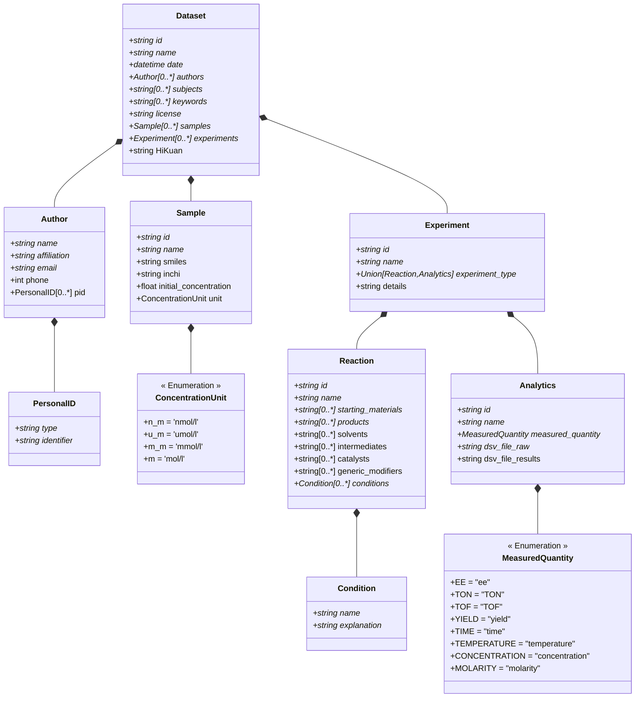

```mermaid
classDiagram
    Dataset *-- Author
    Dataset *-- Sample
    Dataset *-- Experiment
    Author *-- PersonalID
    Sample *-- ConcentrationUnit
    Experiment *-- Reaction
    Experiment *-- Analytics
    Reaction *-- Condition
    Analytics *-- MeasuredQuantity
    
    class Dataset {
        +string id*
        +string name*
        +datetime date*
        +Author[0..*] authors*
        +string[0..*] subjects*
        +string[0..*] keywords*
        +string license*
        +Sample[0..*] samples*
        +Experiment[0..*] experiments*
        +string HiKuan
    }
    
    class Author {
        +string name*
        +string affiliation*
        +string email*
        +int phone
        +PersonalID[0..*] pid
    }
    
    class PersonalID {
        +string type*
        +string identifier*
    }
    
    class Sample {
        +string id*
        +string name*
        +string smiles
        +string inchi
        +float initial_concentration
        +ConcentrationUnit unit
    }
    
    class Experiment {
        +string id*
        +string name*
        +Union[Reaction,Analytics] experiment_type*
        +string details
    }
    
    class Reaction {
        +string id*
        +string name*
        +string[0..*] starting_materials*
        +string[0..*] products*
        +string[0..*] solvents
        +string[0..*] intermediates
        +string[0..*] catalysts
        +string[0..*] generic_modifiers
        +Condition[0..*] conditions*
    }
    
    class Condition {
        +string name*
        +string explanation*
    }
    
    class Analytics {
        +string id*
        +string name*
        +MeasuredQuantity measured_quantity*
        +string dsv_file_raw*
        +string dsv_file_results
    }
    
    class ConcentrationUnit {
        << Enumeration >>
        +n_m = 'nmol/l'
        +u_m = 'umol/l'
        +m_m = 'mmol/l'
        +m = 'mol/l'
    }
    
    class MeasuredQuantity {
        << Enumeration >>
        +EE = "ee"
        +TON = "TON"
        +TOF = "TOF"
        +YIELD = "yield"
        +TIME = "time"
        +TEMPERATURE = "temperature"
        +CONCENTRATION = "concentration"
        +MOLARITY = "molarity"
    }
    
```