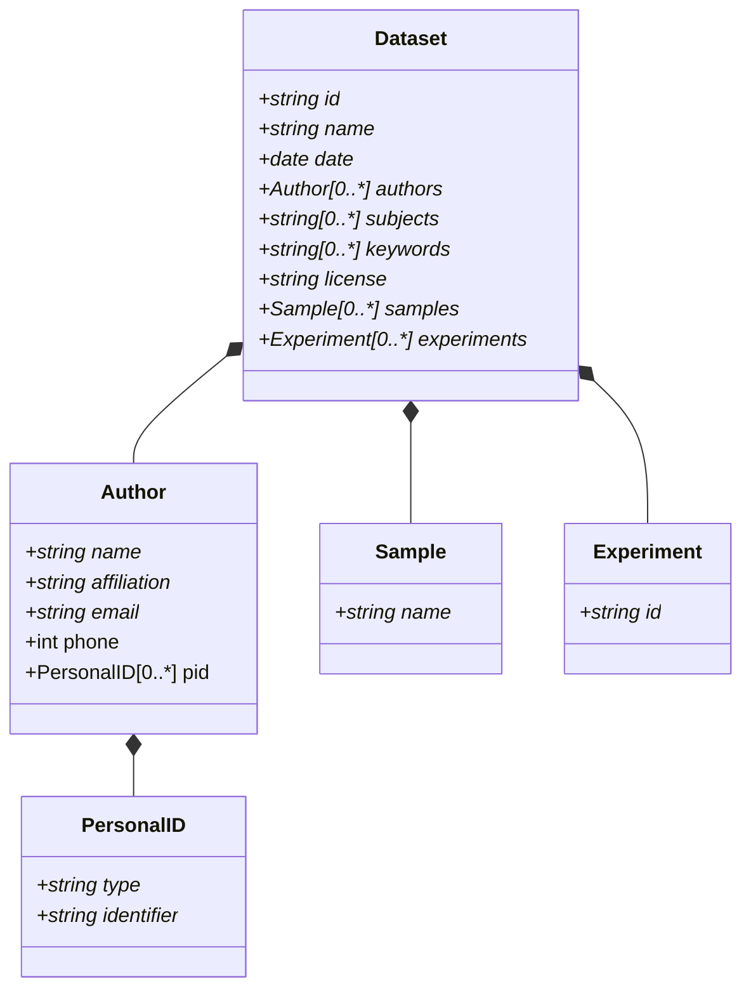

```mermaid
classDiagram
    Dataset *-- Author
    Dataset *-- Sample
    Dataset *-- Experiment
    Author *-- PersonalID
    
    class Dataset {
        +string id*
        +string name*
        +date date*
        +Author[0..*] authors*
        +string[0..*] subjects*
        +string[0..*] keywords*
        +string license*
        +Sample[0..*] samples*
        +Experiment[0..*] experiments*
    }
    
    class Author {
        +string name*
        +string affiliation*
        +string email*
        +int phone
        +PersonalID[0..*] pid
    }
    
    class PersonalID {
        +string type*
        +string identifier*
    }
    
    class Sample {
        +string name*
    }
    
    class Experiment {
        +string id*
    }
    
```