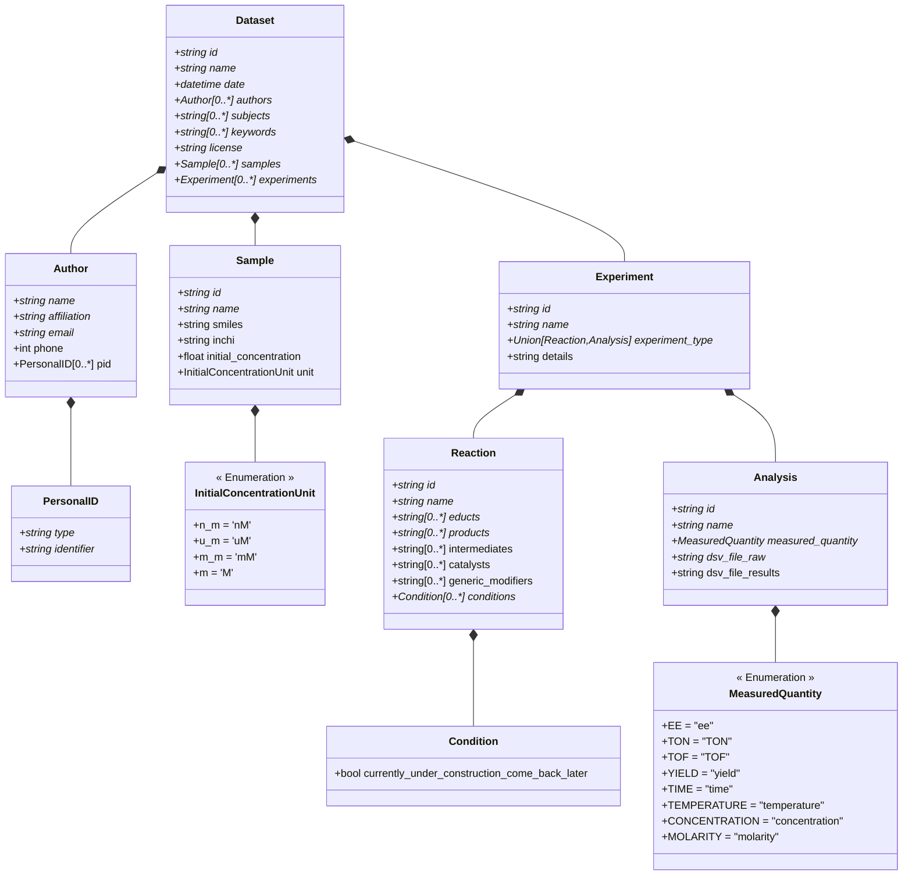

```mermaid
classDiagram
    Dataset *-- Author
    Dataset *-- Sample
    Dataset *-- Experiment
    Author *-- PersonalID
    Sample *-- InitialConcentrationUnit
    Experiment *-- Reaction
    Experiment *-- Analysis
    Reaction *-- Condition
    Analysis *-- MeasuredQuantity
    
    class Dataset {
        +string id*
        +string name*
        +datetime date*
        +Author[0..*] authors*
        +string[0..*] subjects*
        +string[0..*] keywords*
        +string license*
        +Sample[0..*] samples*
        +Experiment[0..*] experiments*
    }
    
    class Author {
        +string name*
        +string affiliation*
        +string email*
        +int phone
        +PersonalID[0..*] pid
    }
    
    class PersonalID {
        +string type*
        +string identifier*
    }
    
    class Sample {
        +string id*
        +string name*
        +string smiles
        +string inchi
        +float initial_concentration
        +InitialConcentrationUnit unit
    }
    
    class Experiment {
        +string id*
        +string name*
        +Union[Reaction,Analysis] experiment_type*
        +string details
    }
    
    class Reaction {
        +string id*
        +string name*
        +string[0..*] educts*
        +string[0..*] products*
        +string[0..*] intermediates
        +string[0..*] catalysts
        +string[0..*] generic_modifiers
        +Condition[0..*] conditions*
    }
    
    class Condition {
        +bool currently_under_construction_come_back_later
    }
    
    class Analysis {
        +string id*
        +string name*
        +MeasuredQuantity measured_quantity*
        +string dsv_file_raw*
        +string dsv_file_results
    }
    
    class InitialConcentrationUnit {
        << Enumeration >>
        +n_m = 'nM'
        +u_m = 'uM'
        +m_m = 'mM'
        +m = 'M'
    }
    
    class MeasuredQuantity {
        << Enumeration >>
        +EE = "ee"
        +TON = "TON"
        +TOF = "TOF"
        +YIELD = "yield"
        +TIME = "time"
        +TEMPERATURE = "temperature"
        +CONCENTRATION = "concentration"
        +MOLARITY = "molarity"
    }
    
```