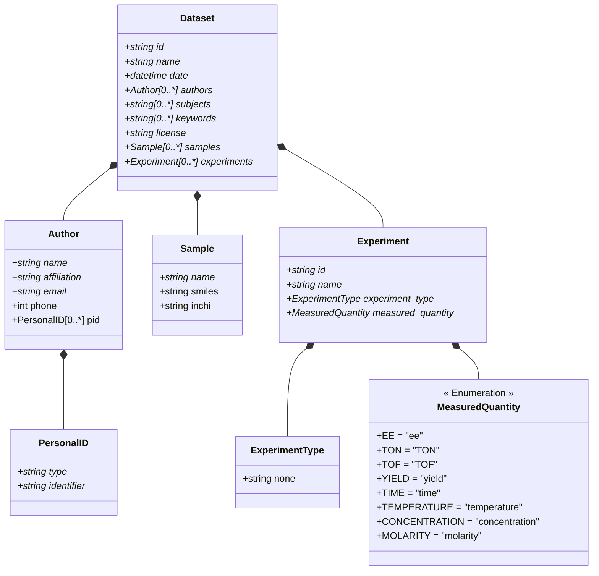

```mermaid
classDiagram
    Dataset *-- Author
    Dataset *-- Sample
    Dataset *-- Experiment
    Author *-- PersonalID
    Experiment *-- ExperimentType
    Experiment *-- MeasuredQuantity
    
    class Dataset {
        +string id*
        +string name*
        +datetime date*
        +Author[0..*] authors*
        +string[0..*] subjects*
        +string[0..*] keywords*
        +string license*
        +Sample[0..*] samples*
        +Experiment[0..*] experiments*
    }
    
    class Author {
        +string name*
        +string affiliation*
        +string email*
        +int phone
        +PersonalID[0..*] pid
    }
    
    class PersonalID {
        +string type*
        +string identifier*
    }
    
    class Sample {
        +string name*
        +string smiles
        +string inchi
    }
    
    class Experiment {
        +string id*
        +string name*
        +ExperimentType experiment_type*
        +MeasuredQuantity measured_quantity*
    }
    
    class ExperimentType {
        +string none
    }
    
    class MeasuredQuantity {
        << Enumeration >>
        +EE = "ee"
        +TON = "TON"
        +TOF = "TOF"
        +YIELD = "yield"
        +TIME = "time"
        +TEMPERATURE = "temperature"
        +CONCENTRATION = "concentration"
        +MOLARITY = "molarity"
    }
    
```